npx create-next-app@latest
## Day 1 -----------------------------------------------------------------
# E-Commerce Application - Temu, Shein
## Tech-Stack:
1. Nextjs 15
 - new caching Technique
 - server components
 - new form components

2. React 19
 - handle dependencies/conflict issues

3. shadcn (open source react component library - Shadcn ui.shadcn.com) - dont need to code for each and every button checkbox, carousal without writing lot of css from scratch etc
 - react component library
 - ready made components - buttons, icons, forms, calender etc

4. Tailwind CSS - to style web application
5. route.ts - for routing
6. CMS - content management system
- separates the presentation layer (where content is presented) from the backend (where content is managed)
- Essentially it's a back-end only system that manages and stores content, providing it through APIs to any front-end or device.
   - Headless CMS - organize each part of content separately. Two parts - content - Backend, API - sends data
    - Difference b/w traditional and Headless CMS
    - basically helps Write store and manage content
    - consist of Frontend - API - Backend
    - e.g: recording room; 
    

7. SANITY - popular Headless CMS (use by Burger King, Nike, Figma)
 - no need to reload
 - GROQ (query to get the content)
 - Visual Editor (Sanity Studio)

8. CLERK (for Authentication)
 - Gmail 
 - Passkeys 

9. TypeScript
10. Stripe (for payment part)
11. Zustand (for State Management ) similar to REDUX
 - local storage
12. Framer Motion (for animations)


## Functionality:
1. How to integrate SANITY to application
2. How to build a complete Stripe Payment
3. Framer motion for animation
4. Shadcn & Tailwind CSS for styling 
5. Clerk for authentication
6. Search, Filter and other common features
7. Deploy in Vercel

## Day2---------------------------------
### my notes
- **To create nextjs project:** npx create-next-app@latest ecommerce-application
- **Create a new Studio with Sanity CLI:** npm create sanity@latest -- --project zxu48kpu --dataset production --template clean --typescript --output-path studio-ecommerce-build
 -------------------- **OR** ---------------------------
if it is not showing template to select then write this command with template blog, see below
sanity@latest -- --project zxu48kpu --dataset production --template **blog** --typescript --output-path studio-ecommerce-build


- **npm install -g @sanity/cli**: install sanity globally in local so can be accessed anywhere in project or any command line
- **sanity logout, sanity login**: commands for terminal to logout or login sanity

## Project notes of Day2 shared by Keerthana:
What Was Covered Today
1. Initial Project Setup – Next.js 15
A new project was created using create-next-app with the following configurations:
TypeScript  used
ESLint enabled
Tailwind CSS enabled
App Router selected (recommended)
Turbopack selected for next dev
Code placed inside src/ directory
Import alias set to @/*
The local development server was successfully launched at:
 http://localhost:3000
2. Sanity Studio Setup
A new Sanity project was created using the CLI.
command (copy from your sanity project): npm create sanity@latest -- --project u3yset1e --dataset production --template clean --typescript --output-path studio-ecommerce-build
Selected a clean project template with a dataset named production.
Output directory: /sanity
Integrated Sanity Studio into the Next.js project using the new App Router approach.
Accessed the studio successfully at:
 http://localhost:3000/studio
3. Clerk Authentication Setup
A new account and project were created on Clerk.com.
Issues Faced & Resolutions :
Typescript issues , solution : npm install --save-dev @types/hast @types/react-is @types/unist @types/which
Sanity Studio, resolve cors error


## Day 3 ------------------------------------(Completed Initial Setup)---------------------------------
1. **Setup the Sanity Studio (it is backend)**
2. **Setup the Clerk for the authentication**
 - **npm install @clerk/nextjs**
 - **Set your Clerk API keys (select your clerk's keys):** NEXT_PUBLIC_CLERK_PUBLISHABLE_KEY=pk_test_ZnVubnktbGl6YXJkLTM5LmNsZXJrLmFjY291bnRzLmRldiQ
CLERK_SECRET_KEY=sk_test_gddkuKSPQDZh3kox6Qrsd2yrdpE3ZDr7q4XguSVjWw -> paste this keys in env.local
 - **Create middleware.ts:** create in `src` and paste the code has given in your clerk's project --> ecommerce-app
 - **Add ClerkProvider to your app:** wrap your entire layout.tsx (src/app/layout.tsx) with ClerkProvider and import it also.
3. **Group level syntax** - separates the top level (the main work of it is: it is simply separation of  frontend and backend from Sanity)
 - **create (store) folder in app:** (store) is for frontend
 - **move layout.tsx from app to (store) folder**
4. **Create layout.tsx inside studio folder:** for studio layout
5. **Move page.tsx from app folder to (store) folder** - so it works independently from backend
==NOTE:== (store) folder - ***frontend*** and studio folder - ***backend***

6. **Blog Schema** we have:
- post
 - categories
 - author
**For e-commerce the blog schema (structure) should be**:
 - Categories
 - Orders
 - Products
 - Sale


## Day 4 ---------------------------------------------
## 1. Implementing Shadcn/ui - DONE
## 2. Building the Header Component: IN PROCESS
   - we use Shadcn to create Header Component (have readymade code for styling)
   - install: npx shadcn@latest init
   - Start adding components to your project. for test try: npx shadcn@latest add button
   - It creates **components folder** with **button.tsx**
   - import button.tsx in page.tsx in (store)
   - Add **Header.tsx** in layout.tsx in (store)
     - **useUser()** hook from '@clerk/nextjs' provides access to the current user's User object, which contains all the data for a single user in your application and provides methods to manage their account. This hook also allows you to check if the user is signed in and if Clerk has loaded and initialized.
   
     - **Nextjs15 Enhanced Form**: useful for forms that update URL search params as it reduces the boilerplate code
       - use of query in input field: When the user updates the query input field and submits the form, the form data will be encoded into the URL as search params, e.g. you write t-shirt, it gives http://localhost:3000/search?query=t-shirt
     - **`<ClerkLoaded>`**: to manage the loading state of the Clerk authentication system within a React application
     - **TrolleyIcon** - @sanity/icons
     - ***Conditional Rendering***: <ClerkLoaded> acts as a wrapper, and its children components are only rendered after Clerk has finished loading. 
     - ***ClerkLoading Companion***: The <ClerkLoading> component, often used in conjunction with <ClerkLoaded>, allows you to display a loading indicator or placeholder content while Clerk is still initializing. 
     - **Tailwind CSS**: apply classes for styling
- **Route Group**: to group related routes together without affecting the URL structure. A route group can be created by wrapping a folder's name in parenthesis: (folderName)
   - ***Example***:  (store) folder in paranthesis will not show in URL for eg. app>(store)>products>page.tsx --> it gives URL as: localhost3000/products/page

- **What is StoreFront:** What users see; product listing, blog etc; store/layout.tsx or app/layout.tsx
- **What is Sanity Studio:** Admin interface; create/edit content; sanity/layout.tsx or part of Studio Config

   

## Day 5 ---------------------------------------------------------------------------
1. **Building the Header Component**: DONE :heavy_check_mark:
2. **Login Logic**:
   - User logged in:--> will show the link --> My orders
3. **SignIn**:
   - imported SignInButton from clerk/nextjs
   - Redirects to clerk hosted sign-in by default
   - **mode**: --> prop, it controls how the SignIn flow (UI) is presented to the user
    - if we give
       - ==mode: model== (it gives modal pop-up in same page), it doesn't open the new signIn page
       - ==mode: redirect== (redirects to the default clerk page)
4. **Passkeys**: --> safer way to login without passwords. Example: fingerprint, face id or pin for login
   - We can implement passkeys using clerk
   - user **createPasskey** method to create it
   - **Setting**: Clerk Dashboard > ecommerce-app > configure > Sign-in options > Enable Passkeys

## Day 6 ------------------------------------------------------------------------------------------------
### To Implement Google SignIn:
   - Clerk UI Components - SignInButton, UserButton
   - Hooks - useUser
### Create Passkey:
   - createPasskey()

1. **SignIn:**
 - Using Google: 
    - `<SignInButton mode="modal" />` comes from clerk (prefedined boiler plate in clerk) -> it open SignIn with google or other methods
   - After successful login ---> clerk uses useUser() hook  --> it fetches the details of user
2. **`<UserButton>`** - it has user profile like Manage Account and SignOut options 
3. **Using Passkey**
    - Create Passkey disapper when passkey is created
    - Passkey is stored in Clerk under Manage Account > Security
    - Passkey option is available to SignIn with passkey
    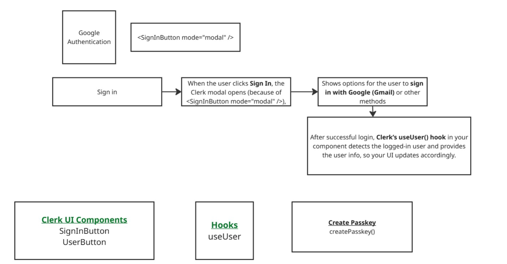
4. **Search** 
    - **`<input>`** with name="query"
       - when you search t-shirt, it gives you http://localhost:3000/search?query=t-shirt
   - Create search folder in (store):  search>page.tsx
   - **Handle search Param**:
        - **Dynamic Parameter** (value which is given by user dynamically eg: search bar)
        - **SearchParams** - query parameter in a URL 
            - (string for search) 
            - (number for pagination)
        - **Query- paramters** - comes after the ? in a URL
     - ***EXPLANATION***:
         1. Form action = /search
         2. When form submits, query string based on the input with the name="query"  (query sent as searchParams to  /search/page.tsx)
           -  **{searchParams,} : { searchParams : {query?: string}} in search>page.tsx**
           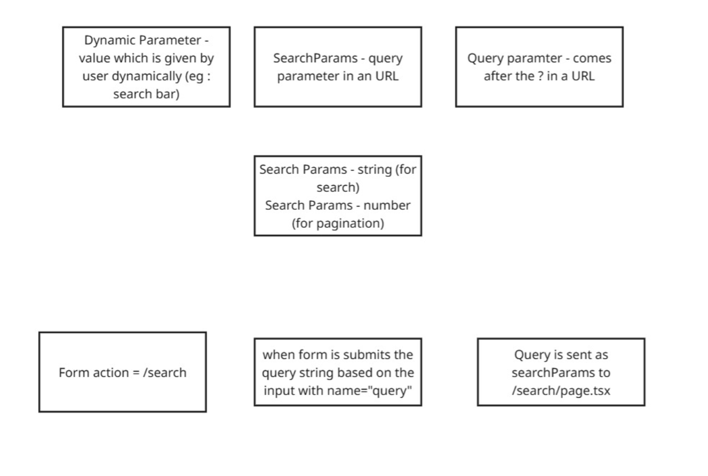
5. **Sanity- populate the database**
6. **Sanity - up running, Schema - up and running, add the product information**
7. **Render the product information in the search page**
8. **Sanity TypeGen**: Type Generation -stores the content (eg: Products, Prices etc) to store type specific content
   - npm install --global sanity@latest (Link: https://www.sanity.io/docs/apis-and-sdks/cli) (can use Sanity in any of your project)
   - sanity schema extract  (it creates scheme.json{}) (Link: https://www.sanity.io/docs/apis-and-sdks/sanity-typegen)
   - sanity typegen generate (it adds in Sanity.types.ts)
   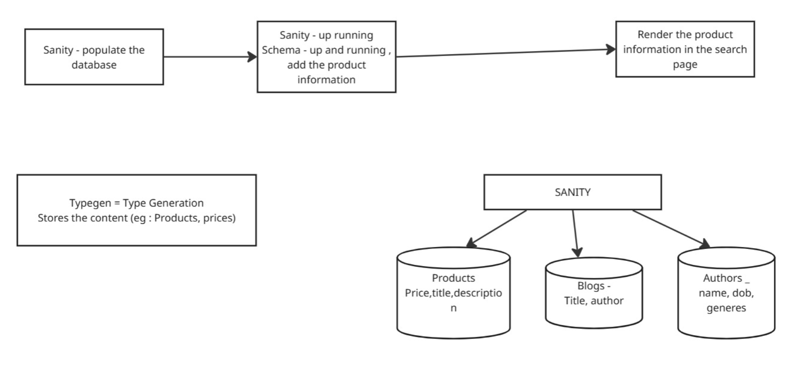


# Day 7 ---------------------------------------------------------------------------------------------------------------

- **What is GROQ?**
Language to fetch data from Sanity content structure.
- **What is TypeGen?**
automatcially creating typescript types from your Sanity content structure.
 


- **Custom run Script:**  To add both cmds -->sanity schema extract, sanity typegen generate
   - In Package.json:  
       - inside **"scripts"** --> add ***"typegen": "npx sanity@latest schema extract && npx sanity@latest typegen generate"***
      - now we just write **npm run typegen** in terminal to run both cmds together
- **`productType`**: `src>sanity>schemaTypes`
   - Create ***`productType.ts`*** inside `Sanity>SchemaTypes`
   - install extensions **Sanity.io** and **Sanity.io snippets**
   - Add `productType` in `index.ts`
   - Add `preview` in `categoryType.ts`
   - In Terminal: npm run typegen ==(whenever you add schemeTypes)==   

   # Day 8 ---------------------------------------------------------------------------------------------------------------
   Today we have covered:
1. Changed **studio structure**: added Products, Order, Sales
2. Created **`orderType.ts`**
   - Create orderType.ts inside Sanity>SchemaTypes
   - Add `orderType.ts` in `index.ts`
   - In Terminal: npm run typegen (whenever you add schemeTypes)
3. Created **`salesType.ts`**
   - Create salesType.ts inside Sanity>SchemaTypes
   - Add `salesType.ts` in `index.ts`
   - In Terminal: npm run typegen (whenever you add schemeTypes)
        


# Day 9 --------------------------------------------------------------
1. **Populate the Data**
  - Get the data from backend and project it in frontend (populating and connecting the sanity backend)
  **Step1: Create a connection to our sanity backend**
  - In client.ts: sanity>lib>client.ts ----> ADD
```ts
stega: {
    studioUrl: process.env.VERCEL_URL 
    ? `https://${process.env.VERCEL_URL}/studio` 
    : `${(process.env.NEXT_PUBLIC_BASE_URL)}/studio` // URL of your Sanity Studio
  }, // Enables the use of the Sanity Studio's "stega" feature for better performance
```

2. **Bulding the backend:**
 - Create **`backendClient.ts`**: sanity>lib> paste the code of client.ts
     - remove stega
     - add token---> token: process.env.SANITY_API_TOKEN,
 - Create ***backend token***: ---> in Sanity ecommerce-bulid > API>ADD API TOKEN - permission-Developer
 - Create ***read token**: ------> in Sanity ecommerce-bulid > API>ADD API TOKEN - permission-Viewer
 - In **`env.local`**:  
      add--> 
      - NEXT_PUBLIC_BASE_URL="http://localhost:3000"
      - SANITY_API_TOKEN= paste the value of **backend token** in Sanity ecommerce-build 
      - SANITY_API_READ_TOKEN= paste the value of **read token** created in Sanity ecommerce-build 
 - In **`live.ts`**: sanity>lib>live.ts
     - create token----> const token= process.env.SANITY_API_READ_TOKEN;

  **Step2**: Install next Sanity https://www.sanity.io/docs/next-js-quickstart/diplaying-content-in-next-js


  # Day 10 --------------------------------------------------------------
1. **Implemented the live server**
   - live.ts enables the Sanity to nextjs app
   - eg. Nextjs-frontend Sanity-manage the products
       - Developer: I am building the application
       - Person-2: Content Management - add or edit product details
       - live.ts: it is used by Person-2 to check the content placement in application. Content adds instantly.

2. **live.ts:**
  - add token
  - fetchOptions

3. **Sanity fetch** --> client fetch; fetches the data, provides live updates in preview updates
4. **Sanity live** ---> automatically updates the UI when content updates in the Sanity
- Sanity uses GROQ queries
  - Created GROQ query in localhost:3000/studio/vision

- Create **products folder** in sanity>lib
     - create **getAllProducts.ts** in products folder
        - use GROQ query: define the query to fetch all products
        - run npm run typegen: it creates the typescript for products in sanity.types.ts
- Create **ProductsView.tsx** in component folder
   - import { Category, Product } from "../../sanity.types";
   - define interface


 # Day 11 -----------------------------------------------------------------------------------------------------------------

- **ProductsView.tsx**: `src>components`
  -  Render products and categories
- **Create getAllCategories.ts**: `src>sanity>lib>products`
    - Define the query to fetch all categories
- **Create ProductGrid.tsx**: `src>components`
    - 
- **Framer motion**:
    - ***Installtion***: npm install motion


# Day 12  --------------------------------------------------------------------------------------------------------------    
Till now what we did in backend part
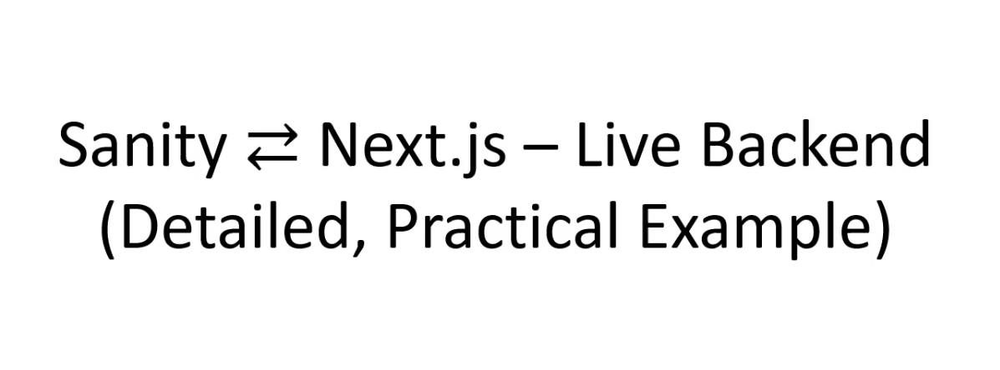


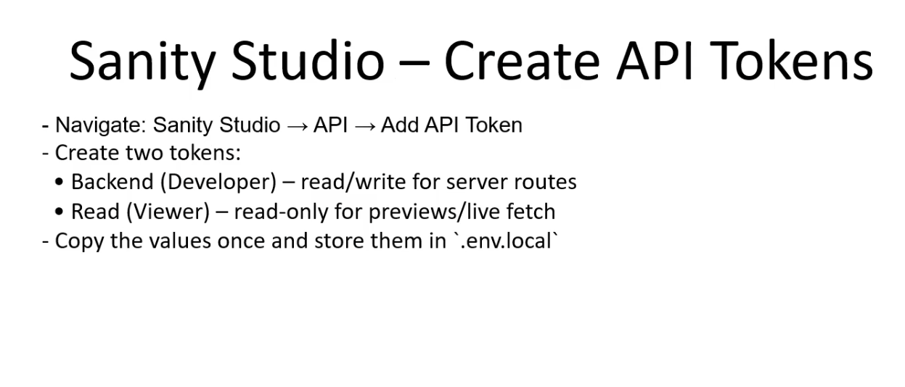
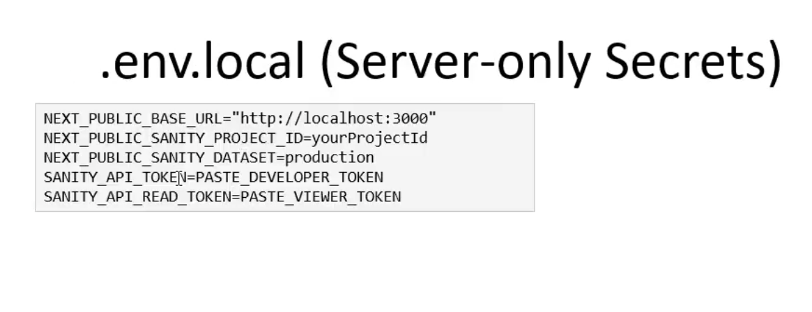
- **Created backendClient.ts** -> it takes up the token from the environment variables created in env.local  -> USE: server-side as an admin, can change the product details, see the live updates there
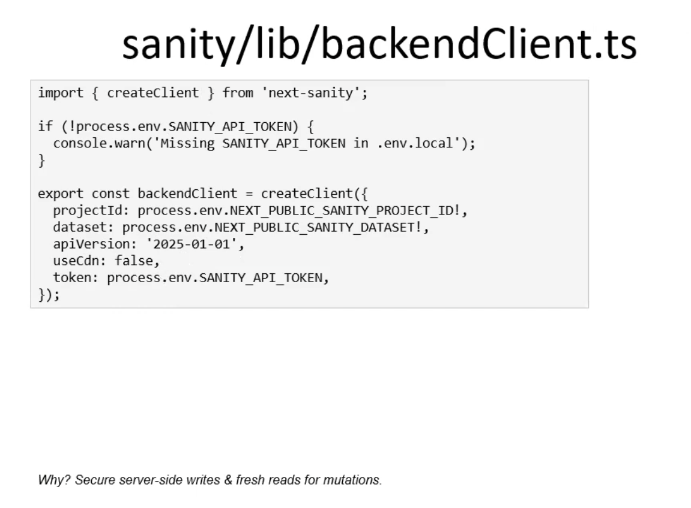
- **Created live.ts**
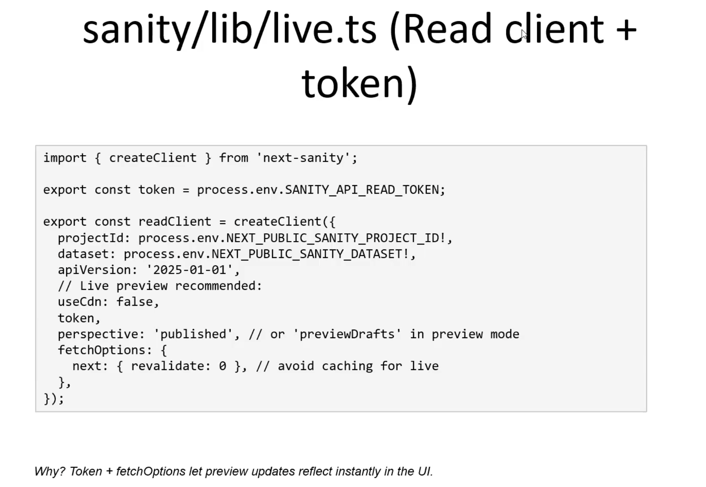
- **Generated GROQ queries**

- **Created getAllProducts.ts** -> created helper function to get all products; add the query so that it can fetch the queries and we can reuse this getAllProducts.ts
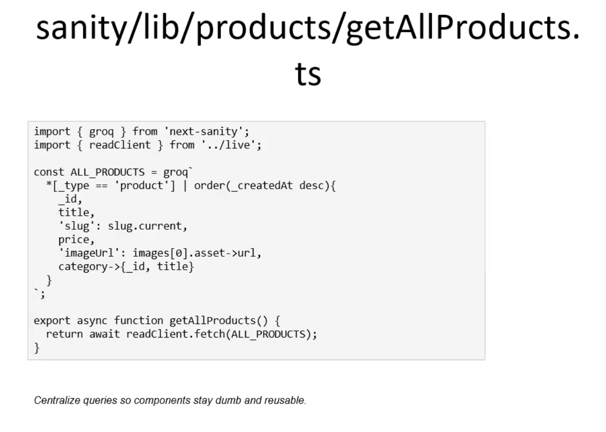
- **Created getAllCategories.ts**

- **Generated the typegen**
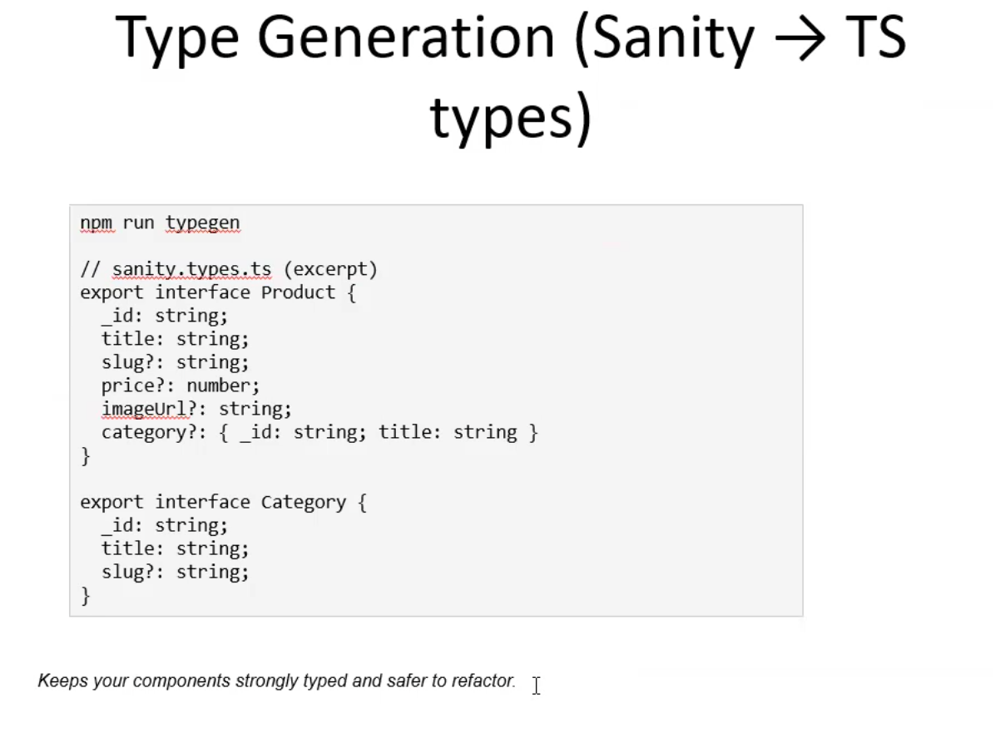
--- ==Above implemented the backend logic --> how to get the products and categories== -------------------------------
- **Created ProductsView.tsx** -> to display in the UI, What the user view on screen

- **ProductGrid.tsx**
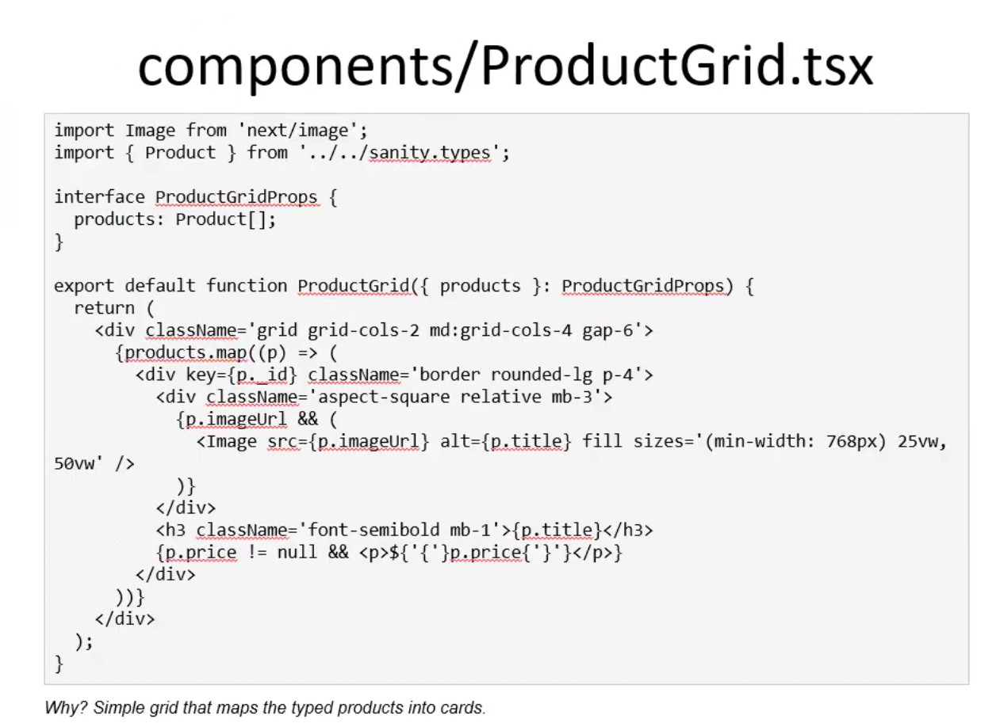
- **Rendering the ProductView in app>(store)>page.tsx**
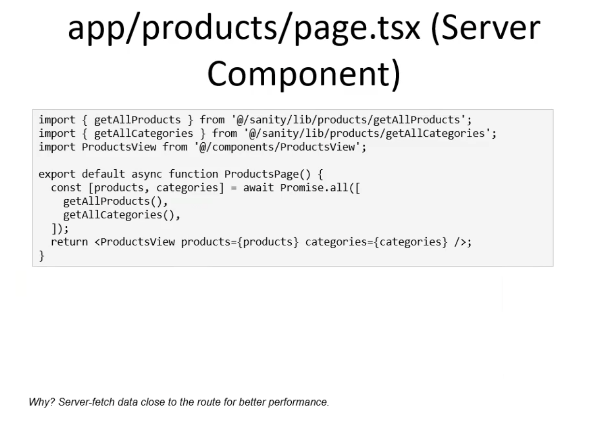

#### To Remember the above steps:
1. Create tokens and store them in env.local
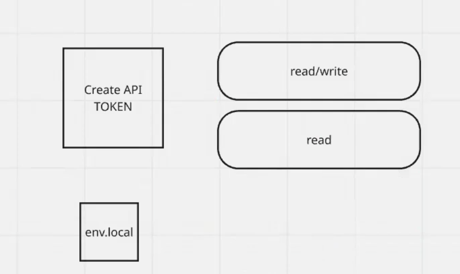
2. Create backendClient.ts

3. Create live.ts

4. Generate GROQ query

5. Create getAllProducts.ts
6. Create getAllCategories.ts

7. Generate the typegen
----till now backend logic------
8. Create ProductsView and ProductGrid.tsx  --> frontend part; how the product is being displayed


New steps in project
1. **Implement Framer Motion** 
    
    


    ## Day 13 -------------------------------------------------------------------------------------------------------
    - Add **slug** define field in **productType.ts**
    - npm install framer-motion
    - Animate presence https://motion.dev/docs/react-animate-presence
    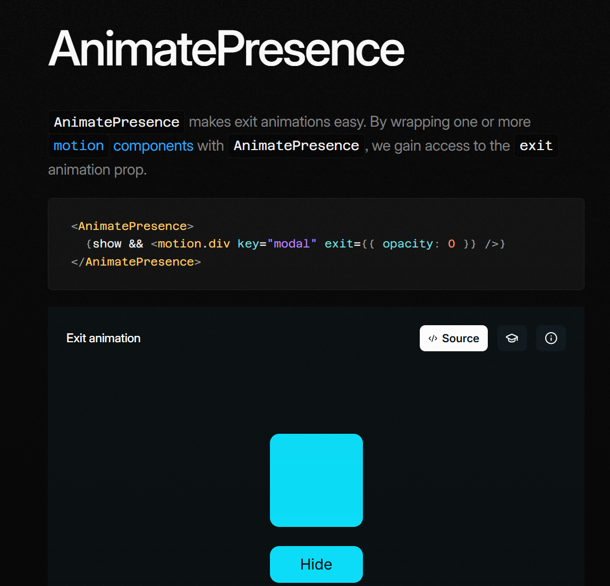
    - In **ProductGrid** -> import { AnimatePresence, motion } from "framer-motion"
    - in **next.config.ts** 
 ```ts
      images: {
    remotePatterns: [
      {
        protocol: "https",
        hostname: "cdn.sanity.io",
      },
    ],
  },
  ```
  - Created **imageUrl.ts** src>lib>imageUrl.ts
  - Created **ProductThumb.tsx** src>components>ProductThumb.tsx
     - import { imageUrl } from "@/lib/imageUrl";
     -  Render the real product content


     ## Day 14 ------------------------------------------------------------------------------------------------------------
- ***E-Commerce Live Updates Fix:***
           - import `SanityLive` and add `<SanityLive/>` component in layout.tsx (src>app>(store)>layout.tsx) for instant updates for product names and stock status without refreshing the page.
- ***Black Friday Banner Implementation:***
   - Implemented black friday Sale Banner with coupon code functionality
      - Create **Black Friday** sale in Sales (studio)
      - Implemented a black Friday Sale banner --> We want to allow the product team to post or change these things by themselves without depending on developer
      - Created **sale folder** in sanity>lib>sale
         - Created **getActiveSaleByCouponCode.ts** inside sale folder
         - Created **couponCodes.ts** inside sale folder
      - Created **BlackFridayBanner.tsx** in src>components
      - In **page.tsx** (src>app>(store)>page.tsx) import and add BlackFridayBanner component
      - npm run typegen

- **Assignment**:
Complete today's steps
Add 10-20 products and number of categories in studio
Tomorrow will start with search functionalities


## Day 15 ------------------------------------------------------------------------------------------------------------

- **Search Functionality**
  - Created **`searchProductsByName.ts`** in **`products`** `sanity>lib>products`
    - Define the query to fetch the products by name
  - Implemented **`search>page.tsx`**  in `src>app>(store)>search`
    - Import the `ProductGrid component` to display products in a grid layout
    - Import the function to `searchProductsByName` from the Sanity backend
    - Logic to display the searched products.


## Day 16 -------------------------------------------------------------------------------------------------------------

- **Displaying the product information**
    - Create **product>[slug]>page.tsx**   ---> [slug] for dynamic value, it doesn't show in URL
    - Create **helper function getProductBySlug.ts** in sanity>lib>products
    - npm run typegen --> 16 schema types and 5 GROQ queries
    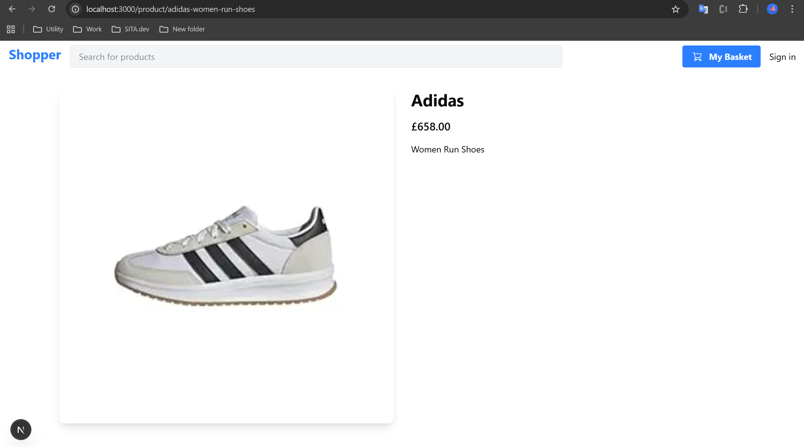


## Day 17 -------------------------------------------------------------------------------------------------------------

- To use ***ClassName='prose'***in **product>[slug]>page.tsx**:-->
     - **Install typography**: npm install -D @tailwindcss/typography   https://github.com/tailwindlabs/tailwindcss-typography
     - **Add @plugin** "@tailwindcss/typography"; in **app>global.css**

- **Implementing search by category**
    - Shadcn - **combobox**: (combination of popover and command) https://ui.shadcn.com/docs/components/combobox   
    - Shadcn - **Popover**: https://ui.shadcn.com/docs/components/popover#installation
    - **npx shadcn@latest add popover command**
      -  It created 3 files:
                    - src\components\ui\popover.tsx
                    - src\components\ui\command.tsx
                    - src\components\ui\dialog.tsx

   - Create **category-selector.tsx** in components>ui
       - Create custom component **CategorySelectorComponent** inside category-selector.tsx


## Day 18 -------------------------------------------------------------------------------------------------------------
- Overview of **category-selector.tsx** in components>ui

- Building **category page** to Get Products By Category
    - Create a route: **app>(store)>categories>[slug]>page.tsx**
    - Create helper function **getProductsByCategory.ts** in `sanity>lib>products`  (with GROQ queries and try and catch)
   - npm run typegen   - generated 6 GROQ queries

- Implementing Loader Component **loading.tsx**:  `app>(store)>loading.tsx`
    - Create **Loader.tsx** in `src>components>Loader.tsx`

- **Implementing Zustand for state management**
    - npm install zustand  https://github.com/pmndrs/zustand
    - Create store: **store.ts** in `app>(store)`


## Day 19 -------------------------------------------------------------------------------------------------------------
- Implement Zustand For State Management
     - Install the zustand
     - store.ts in src>store>store.ts
          - Interface for Basket item (blueprint)
          - To build the functionality --> create() from zustand  --> commonly used (state is not stored, all data will be lost on page reload) -- but we use Persist middleware that has create() also in it
          - Persist middleware - zustand feature --> stores data in the storage like local storage. Automatically saves the data even when page reload  (data will be stored in local or session storage, rehydrates the data when app reloads)
     - Created a grouped object for items, add item, remove item, clearBasket, getTotalePrice, getItemCount, getGroupedItems
     - AddToBasketButton.tsx in src>components 
     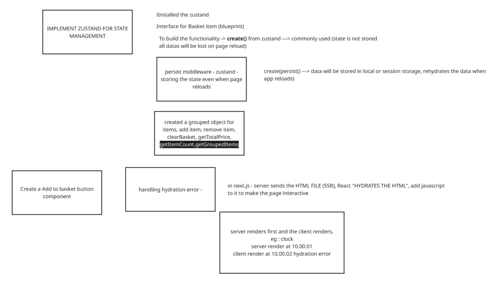


## Day 20 --------------------------------------------------------------------------------------------------------------
-State Management: itemCount displayed at top of Add to Basket button. In Header.tsx src>components>Header.tsx
    - const itemCount = useBasketStore((state) =>     state.items.reduce((total, item) => total + item.quantity,0))
    - <span className='absolute -top-2 -right-2 bg-red-500 text-white rounded-full w-5 h-5 flex items-center justify-center text-xs'>{itemCount}</span>

- MyBasket Page  src>app>(store)>basket>page.tsx: stripe - payment; checkout
     - Display products in MyBasket


## Day 21 --------------------------------------------------------------------------------------------------------------

https://dashboard.stripe.com/test/workbench/overview

- **Implemented Add to Basket functionality with checkout** in **MyBasket Page** in   `src>app>(store)>basket>page.tsx`
 - we are basically send the user to stripe for the payment
 - Process the payment and save it in our backend
 - Later we can use to complete order and track it
    - Order Summary - sticks to the bottom
    - **Checkout Button** - whether user is sign in or not. If it is signed in - it goes to payment otherwise sign in page
    - Checkout Functionality
          - setup the metadata
          - checkout url
- Server actions 
     - Created **actions** folder in the root
           - Created **createCheckoutSession.ts**  in `src>actions`
                  - "use server"
                  - define the metadata
                  - create helper function
 - Implementing Stripe for payment
    - Create **stripe.ts** inside `lib>stripe.ts`
    - npm i stripe
    - Copy scret key from stripe and save it in env.local
    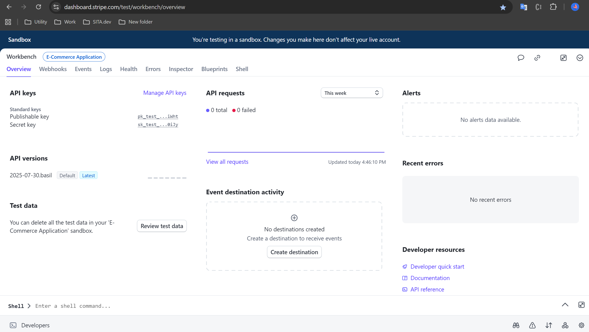
   
## Day 22 --------------------------------------------------------------------------------------------------------------------------
- fake card for testing stripe payment https://docs.stripe.com/testing#cards
   - In Customers section of stripe, we get the information customer made payment.
   - Once the payment is completed, 
    web hook - payment is succeeded, succeful payment page will be shown
- Create **success>page.tsx** inside `src>app>(store)`


## DAY 23 -----------------------------------------------------
- To store transaction details in Sanity from Stripe
    -  https://dashboard.stripe.com/test/workbench/webhooks --> Test with the Local Listerner
          - Download Stripe CLI 
    
    - Download stripe_1.30.0_windows_x86_64.zip
      from https://github.com/stripe/stripe-cli/releases/tag/v1.30.0
        - paste the extract zip file in `Program Files (x86)
        - copy the path of stripe inside the file `stripe_1.30.0_windows_x86_64`
        - Open System Environment Vairables in windows
          - paste the path in Environment Variables > user variables himan and system variables
    - cmd --> stripe --version
    - cmd--> stripe listen --forward-to localhost:3000/webhook 
       - you will see --> Press Enter to open the browser or visit https://dashboard.stripe.com/stripecli/confirm_auth?t=FWpmLihFQzrHKJxAuswhdnzHWu7HJysf (^C to quit)
    - run again --> stripe listen --forward-to localhost:3000/webhook 
    - copy the secret stripe key -->  whsec_f53e9a2a97a9197c3093fc97bad5ac55c4e07ff79d9121ba2095fa91200a22b5
    - paste the value of secret key in .env.local --> STRIPE_WEBHOOK_SECRET=whsec_f53e9a2a97a9197c3093fc97bad5ac55c4e07ff79d9121ba2095fa91200a22b5
    

## DAY 24 by me
- Create **route.ts** in `src>app>(store)>webhook`
- Create **coupon** in stripe `stripe>Ecommerce Application> Product catalog`
 
    
- Add Promotion Code 
 

- In Sanity (You will face error in terminal : It will show permission required: to overcome, follow below steps)
    - create API token with name again " backend token ", with editor access -  then copy key
    - Go to vs code : go to env.local file - replace the value of SANITY_API_TOKEN= add the newly copied key

- Run below two commands before doing transaction, so that it shows the transaction in Studio under order section
    - run stripe login
    - stripe listen --forward-to localhost:3000/webhook


## DAY 25 by me
### Building the Orders Page
- Create `orders>page.tsx` in `src>app>(store)`
- Create `orders>getMyOrders.ts` in `sanity>lib`
- Terminal --> npm run typegen
- Create Helper function `formatCurrency.ts` in `src>lib`


## NOTE ------------------
-------------------------------------------------------------------------
> ***NOTE***
> - Run below two commands before doing transaction, so that it shows the transaction in Studio under order section
> - run stripe login
>  - stripe listen --forward-to localhost:3000/webhook
------------------------------------------------------------------------

## Day 26 by me
- Sanity Studio | Visual Editing --> https://www.sanity.io/docs/visual-editing/configuring-the-presentation-tool
- Add `presentationTool` in `sanity.config.ts`
- Create `draft-mode` folder in `app`
  - Create `enable` `disable` folder in `draft-mode`
  - Create `route.ts` in `enable` to enable the draft-mode
  - Create `route.ts` in `disable` to disable the draft-mode
- In `layout.tss` in `src>app>(store)`
  - import { VisualEditing } from "next-sanity";
  - import { draftMode } from "next/headers";  
- Create `DisableDraftMode.tsx` in `src>components` 
- - In `layout.tss` in `src>app>(store)`
  - import { draftMode } from "next/headers";
  - import { DisableDraftMode } from "@/components/DisableDraftMode"; 
  - Add inside `<body>` 
  ```js      
   {(await draftMode()).isEnabled && (
          <>
          <DisableDraftMode />
          <VisualEditing />
          </>
        )}
   ```     
 -   
 ```js
  stega: {
    studioUrl: process.env.NODE_ENV === "production"                              //old code line --> process.env.VERCEL_URL 
    ? `https://${process.env.VERCEL_URL}/studio` 
    : `${process.env.NEXT_PUBLIC_BASE_URL}/studio` // URL of your Sanity Studio
  },

   ```
   - 


# Day 27 by me
- Implementing caching functionality
  - Dev mode is always going to render serverside render each page. It is always going to give us up-to-date information but **Nextjs 15** doesn't cache by default
    - How to ensure that all stuff are left up-to-date in Nextjs
     - Add in `src>app>(store)>page.tsx`
      ```tsx
      export const dynamic = "force-static";
      export const revalidate = 60; // revalidate at most every 60 seconds
      ```
     - Add in `src>app>(store)>product>[slug]>page.tsx`

     ```tsx
      export const dynamic = "force-static";
      export const revalidate = 60; // revalidate at most every 60 seconds
       
       // inside async function ProductPage
      console.log(
      crypto.randomUUID().slice(0, 5) +
      `>>> Rerendered the product page cache for ${slug}`
      );
    ```

    - npm run build && npm run start


## Deployment in Vercel 

- Add .env.local variables in Environment variables
- Create **Event destination endpoint url** in Stripe>Developer>Webhook
  - Select checkout option
  - paste vercel project url with `/webhook`
- Copy the **Signing secret key** from **Stripe Webhook** and paste it in 
`STRIPE_WEBHOOK_SECRET` key's value in Vercel `Environment Variables`

- Add Vercel url domains in `sanity>ecommerce-build>API>CORS Origins`
- Update `src>actions>createCheckoutSession.ts`
  ```tsx 
  const baseUrl = process.env.NEXT_PUBLIC_BASE_URL;  // before vercel deployment the value is  --> //process.env.NODE_ENV === 'production' ? `https://${process.env.VERCEL_URL}` : process.env.NEXT_PUBLIC_BASE_URL;
   ```
- update NEXT_PUBLIC_BASE_URL in **VERCEL** --> Environment Variable with value of vercel domain: 
    - `https://nextjs-ecommerce-application-sage.vercel.app`


git add .
git commit -m "initial commit"
git branch -M main
git push -u origin main
